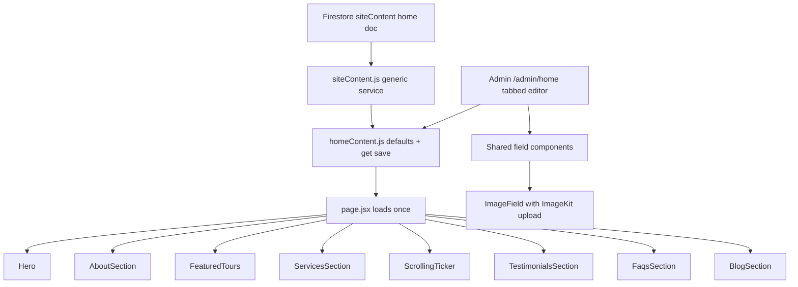

# Dynamic Home Page Content — Admin Plan

## Goal
Make every section of the home page editable from the admin, organized **page-wise** (`/admin/home`) so the same pattern extends to other pages (about, services, contact…) later.

## Current State
- Hero is already dynamic (`src/lib/heroData.js` + `/admin/hero`, Firestore doc `siteContent/home-hero`).
- 7 remaining sections are hardcoded: About, Featured Tours, Services, Scrolling Ticker, Testimonials, FAQs, Blog.

## Architecture

### 1. Generic service — `src/lib/siteContent.js`
- `deepMerge(defaults, saved)` — objects merge, arrays replace.
- `getPageContent(pageId, defaults)` — reads `siteContent/{pageId}`, deep-merges over defaults, falls back to defaults on error/no-config.
- `savePageContent(pageId, content)` — merged `setDoc` write with `updatedAt`.

### 2. Home model — `src/lib/homeContent.js`
`defaultHomeContent` with one key per section (each with `visible: true`):

| Section | Fields |
|---|---|
| hero | existing model moved from heroData.js |
| about | subtitle, titlePart1/2, description, features[icon+text], image1/2, avatars[], counterValue, counterLabel, button, backgroundText |
| featuredTours | subtitle, titlePart1/2, description, button, tours[image, location, title, duration, rating, price, priceUnit, link] |
| services | titlePart1/2, circleText, services[icon, title, link], backgroundImage |
| ticker | items[string] |
| testimonials | subtitle, titlePart1/2, testimonials[image, title, rating, text, avatars[]] |
| faqs | subtitle, titlePart1/2, image1/2, faqs[question, answer, icon], backgroundText |
| blog | subtitle, titlePart1/2, posts[image, date, title, excerpt, postLink, blogLink] |

`getHomeContent()` / `saveHomeContent()` wrap the generic service with doc id `home`. Hero loader also falls back to the legacy `home-hero` doc so already-saved hero content is not lost.

### 3. Section components
Each accepts an optional `content` prop, falls back to its slice of defaults (instant render, no layout shift), keeps the theme markup/classes exactly so CSS/GSAP animations are untouched. `page.jsx` does one `getHomeContent()` call and passes slices down; sections with `visible: false` are skipped.

### 4. Admin editor — `/admin/home`
- Tab bar: Hero · About · Featured Tours · Services · Ticker · Testimonials · FAQs · Blog.
- Each tab = form cards for that section's fields + a visibility toggle.
- Shared components in `src/app/admin/home/fields.jsx`:
  - `TextField`, `TextareaField`
  - `ImageField` — URL input + ImageKit upload button + thumbnail
  - `ListEditor` — repeatable rows with add/remove (features, tours, services, ticker items, testimonials, faqs, posts, avatars)
- Sticky save bar: Save & publish (whole doc), Reset section to defaults, success/error message.
- `/admin/hero` becomes a redirect to `/admin/home` (nav updated: "Home page").

### 5. Styles
Extend `admin.css`: tab bar, list editor rows, image field rows, visibility toggles — reusing existing admin design tokens.

## Steps
1. `src/lib/siteContent.js` — generic deep-merge + Firestore service.
2. `src/lib/homeContent.js` — all 8 section models + get/save + hero legacy fallback.
3. Refactor `heroData.js` to delegate to homeContent (keep API).
4. Refactor the 7 hardcoded components to data-driven with `content` prop.
5. Update `page.jsx` — single load, pass props, respect visibility.
6. `src/app/admin/home/fields.jsx` — shared editor field components.
7. `src/app/admin/home/page.jsx` — tabbed editor for all sections.
8. `/admin/hero` redirect + AdminShell nav update.
9. `admin.css` editor styles.
10. Production build verification.
