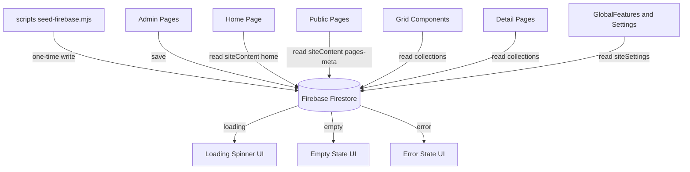

# Firebase-Only Data Migration Plan

## Goal

All admin pages and all public website pages must read/write data **exclusively from Firebase Firestore**. No fallback data, no mock data, no demo config anywhere in the runtime code. When Firebase returns empty data or errors, the UI shows explicit loading / empty / error states instead of hardcoded content.

## Decisions (confirmed with user)

1. **Seed current content into Firebase first** (one-time migration) so the site keeps its current appearance, then remove all fallbacks.
2. **Strict Firebase-only behavior**: on error or empty results, show empty/loading/error states — no content is ever rendered from code.

## Current Fallback Inventory

| Location | Fallback behavior |
|---|---|
| `src/lib/firestoreService.js` → `getCollectionItems()` | Returns `fallbackData` when Firebase unconfigured, collection empty, or read error |
| `src/lib/siteContent.js` → `getPageContent()` | Deep-merges Firestore doc over hardcoded defaults; returns defaults on error/missing |
| `src/lib/homeContent.js` → `defaultHomeContent` | ~280 lines of hardcoded home page content used as fallback + initial state |
| `src/lib/pagesContent.js` → `defaultPagesContent` | Hardcoded content for 10 pages (about, tours, destinations, services, blog, post, contact, faq, team, testimonials) |
| `src/lib/firebase.js` | Demo config fallbacks (`demo-api-key`, `demo-project`, ...) |
| `src/app/admin/adminData.js` | Entire file is dead mock data (no imports found) |
| 11 admin pages | Dead `initialXxx` mock arrays (declarations only, never referenced) |
| `src/app/admin/settings/page.jsx` | `defaultSettings` merged over Firestore data |
| `src/app/components/GlobalFeatures.jsx` | `defaultSettings` + localStorage cache fallback |
| Public pages & components | `useState(defaultXxx)` initial states + inline fallbacks (e.g. `t.price \|\| '₹24,999'` in FeaturedTours, `tour?.overview \|\| '...'` chains in tour-details) |
| Detail pages (tour/post/team/service-details) | Extensive inline fallback chains for every field |

## Target Architecture

**Data layer contract (strict):**
- `getCollectionItems(name)` → returns array (possibly empty); **throws** on error — no fallback parameter.
- `getPageContent(pageId)` → returns document data or `null` if missing; **throws** on error — no defaults merge.
- `savePageContent(pageId, content)` → writes exactly what the admin edited (`setDoc` + `merge: true`); no `deepMerge` with defaults.
- `firebase.js` → no demo values; missing config fails fast with a clear error.

**UI states (all data-driven views):**
- Loading → spinner (most pages already have `loading` state).
- Error → message like "Could not load tours. Please try again." (with retry where practical).
- Empty → "No tours yet" style placeholder.
- Detail pages → "Not found" state when no matching document.

**What stays in code (not content data):** page layout/chrome, navbar link structure, icon class names in admin form definitions, blank form templates for new records (e.g. `emptyBooking`), CSS/JS assets.

## Implementation Phases

### Phase 1 — Seed migration (must run before removing fallbacks)

1. Create `scripts/seed-data.mjs` — single source of seed content extracted from current code:
   - `siteContent/home` ← `defaultHomeContent`
   - `siteContent/pages-meta` ← `defaultPagesContent`
   - `siteSettings/general` ← settings defaults (from admin settings page + GlobalFeatures)
   - Collections: `tours`, `destinations`, `services`, `team`, `posts`, `testimonials`, `faqs`, `bookings`, `customers`, `inquiries`, `subscribers` ← the `initialXxx` arrays currently dead in admin pages
2. Create `scripts/seed-firebase.mjs` — loads `.env.local`, initializes Firebase (Node-compatible), writes all seed documents idempotently (skips existing docs so it can be re-run safely).
3. Run the seed script and verify Firestore contains all documents.

### Phase 2 — Data layer refactor

4. `src/lib/firebase.js` — remove demo config fallbacks; throw descriptive error if required env vars are missing.
5. `src/lib/firestoreService.js` — remove `fallbackData` parameter and the "not configured" early return; let errors propagate.
6. `src/lib/siteContent.js` — remove `deepMerge` fallback logic; `getPageContent` returns `null` for missing docs; `savePageContent` writes content directly.
7. `src/lib/homeContent.js`, `src/lib/pagesContent.js`, `src/lib/heroData.js` — delete default content exports; keep pure Firestore accessors (also drop the legacy `home-hero` migration, superseded by seeding).

### Phase 3 — Public pages & components

8. Update 10 public pages (`page.jsx`, about, tours, services, destination, contact, blog, faq, team, testimonials): initial state `null`, render loading/error/empty states, no `defaultXxx` imports.
9. Update 14 components (Hero, FeaturedTours, ToursGrid, ServicesGrid, ServicesSection, DestinationsGrid, TeamSection, TestimonialsGrid, TestimonialsSection, BlogGrid, BlogSection, FaqContent, Footer, GlobalFeatures): remove default props and inline `||` fallbacks; add empty/error states; remove localStorage cache in GlobalFeatures.
10. Update 4 detail pages (tour-details, post, team-details, service-details): remove all inline fallback chains; render only Firestore fields; "Not found" state when no match.

### Phase 4 — Admin pages

11. Delete dead `initialXxx` arrays from 11 admin pages (tours, testimonials, team, subscribers, services, posts, inquiries, faqs, destinations, customers, bookings).
12. `src/app/admin/settings/page.jsx` — remove `defaultSettings`; load exclusively from Firestore with loading/error states.
13. `src/app/admin/pages/page.jsx` (home/pages/footer editor) — initial state from Firestore only; forms render empty until loaded.
14. `src/app/admin/AdminSection.jsx` + `src/app/admin/page.jsx` (dashboard) — error handling for failed reads.
15. Delete `src/app/admin/adminData.js`.

### Phase 5 — Verification

16. Grep audit: no `fallback`, `mock`, `initialXxx`, `defaultHomeContent`, `defaultPagesContent`, `demo-` patterns left in `src/`.
17. Run dev server; verify home, all public pages, all detail pages, and all admin pages render from Firestore; test empty-collection and error behavior (e.g. temporary bad project id).

## Risks & Notes

- **Order matters**: seeding (Phase 1) must succeed before Phase 2/3 land, otherwise the site renders empty.
- **firebase.js fail-fast**: without env vars the app now throws at startup instead of silently using demo config — this is intentional (misconfiguration should be loud). `.env.local` is already configured in this workspace.
- **Admin form UX**: editors start empty and populate once Firestore responds; field structure remains code-defined so forms still render correctly.
- **Seed script is a migration artifact**, clearly isolated under `scripts/` — it is never imported by runtime code.
