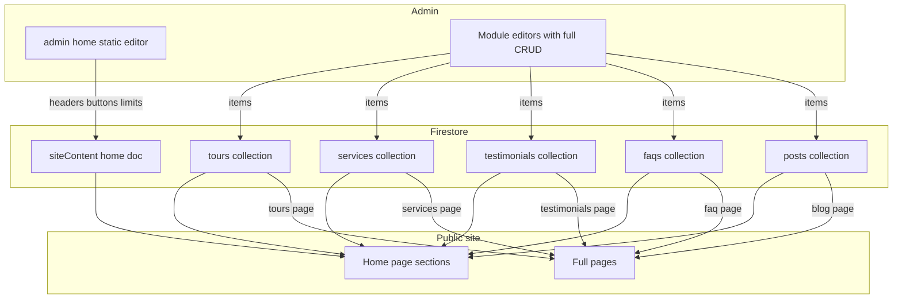

# Global Content Modules + Static Page Content — Production Plan

## Goal

Split home page content into two clearly separated layers:

1. **Static page content** — section headers, buttons, images, item limits. Managed per-page in `/admin/home` (existing tabbed editor, simplified).
2. **Global content modules** — the actual items (tours, services, testimonials, FAQs, blog posts). Managed once in dedicated module admins (`/admin/tours`, `/admin/services`, `/admin/testimonials`, `/admin/faqs`, `/admin/posts`) and consumed by BOTH the home page sections AND the full pages (`/tours`, `/services`, `/faq`, `/blog`, `/testimonials`).

Editing a tour once updates it everywhere it appears.

---

## Architecture



---

## Content split per section

| Home section | Static — stays in /admin/home | Module — moves to global collection |
|---|---|---|
| Hero | All (kicker, titles, description, buttons, collage, decorations) | — |
| About | All (texts, images, features, avatars, counter) | — |
| Featured Tours | subtitle, titlePart1/2, description, button, **maxItems** | `tours` collection (featured items) |
| Services | titlePart1/2, circleText, backgroundImage, **maxItems** | `services` collection |
| Ticker | All (items list) | — |
| Testimonials | subtitle, titlePart1/2, **maxItems** | `testimonials` collection |
| FAQs | subtitle, titlePart1/2, image1, image2, backgroundText, **maxItems** | `faqs` collection |
| Blog | subtitle, titlePart1/2, **maxItems** | `posts` collection |

`maxItems` (number field, e.g. 3) controls how many module items each home section renders.

---

## Module item schemas

Unified schemas serving home sections, full pages, and admin editors. All modules share: `order` (number, manual sort), `status` (`'published'` | `'draft'`), plus Firestore-managed `id`, `createdAt`, `updatedAt`.

### tours — collection `tours`
| Field | Type | Notes |
|---|---|---|
| title | string | e.g. "Maldives Paradise Escape" |
| location | string | e.g. "Maldives, Asia" |
| duration | string | e.g. "6 Days - 5 Nights" |
| rating | string | e.g. "4.9" |
| price | string | e.g. "$499" |
| priceUnit | string | default "/ Traveler" |
| image | string | ImageKit URL or /assets path |
| link | string | default "/tour-details" |
| featured | boolean | home Featured Tours shows only featured |
| order / status | number / string | shared |

Legacy normalization: docs created by the old AdminSection add-modal used `name`/`destination` — map `name→title`, `destination→location` on read.

### services — collection `services`
| Field | Type | Notes |
|---|---|---|
| title | string | e.g. "Custom Tour Packages" |
| description | string | shown on /services grid |
| icon | string | FontAwesome class, e.g. "fa-route" |
| link | string | default "/service-details" |
| order / status | number / string | shared |

### testimonials — collection `testimonials`
| Field | Type | Notes |
|---|---|---|
| title | string | e.g. "Africa Tour" |
| text | string | quote body |
| rating | number | 1–5 |
| image | string | main image |
| avatars | string[] | traveler avatar URLs |
| order / status | number / string | shared |

### faqs — collection `faqs`
| Field | Type | Notes |
|---|---|---|
| question | string | accordion title |
| answer | string | accordion body |
| icon | string | FontAwesome class |
| order / status | number / string | shared |

### posts — collection `posts`
| Field | Type | Notes |
|---|---|---|
| title | string | |
| excerpt | string | |
| date | string | display date, e.g. "28 Dec 2026" |
| image | string | |
| category | string | e.g. "Travel tips" |
| author | string | |
| postLink | string | default "/post" |
| order / status | number / string | shared |

---

## New files

### `src/lib/moduleContent.js`
Seed data (defaults) for all 5 modules, extracted from the current inline arrays in `homeContent.js` and the hardcoded full-page grids. Seeds are the fallback when a Firestore collection is empty or Firebase is not configured — the site never renders empty.

### `src/lib/moduleService.js`
Module data service wrapping `firestoreService.js`:

- `getModuleItems(moduleName)` — reads collection, falls back to seeds, normalizes legacy field names, filters nothing (admin sees all), sorts by `order` asc then `createdAt` desc. Includes a lightweight in-memory cache (~30s TTL) so navigating between pages doesn't refetch; cache is invalidated on any admin write.
- `getPublishedModuleItems(moduleName)` — same but filters `status !== 'draft'` (public pages/sections use this).
- `saveModuleItem(moduleName, item)` — add when no `id`, update when `id` present. New items get `order = max + 1`.
- `deleteModuleItem(moduleName, id)`
- `setModuleItemOrder(moduleName, id, newOrder)` — persist reorder.
- `importDefaultItems(moduleName)` — one-time write of all seed docs into Firestore (explicit admin action, not automatic).

### `src/app/admin/ModuleEditor.jsx`
Generic, schema-driven CRUD editor used by all 5 module admin pages:

- **Toolbar**: search, "Add {item}" button, "Import default items" button (shown only when collection is empty).
- **Table**: thumbnail, primary fields, featured toggle (tours only), status badge, order up/down buttons, Edit and Delete actions.
- **Add/Edit modal**: form rendered from a per-module field config. Field types: `text`, `textarea`, `image` (ImageField with ImageKit upload), `number`, `select` (status), `stringlist` (avatars). Reuses the shared field components from `src/app/admin/home/fields.jsx`.
- **Delete**: confirmation before `deleteModuleItem`.
- Config shape:

```js
const moduleConfig = {
    tours: {
        title: 'Tours', singular: 'Tour', collection: 'tours',
        supportsFeatured: true,
        fields: [ { name: 'title', label: 'Title', type: 'text', required: true }, ... ],
        columns: [ { key: 'title', label: 'Tour' }, { key: 'location', label: 'Location' }, ... ],
    },
    services: { ... }, testimonials: { ... }, faqs: { ... }, posts: { ... },
};
```

### New admin pages
- `src/app/admin/services/page.jsx` → `<ModuleEditor module="services" />`
- `src/app/admin/testimonials/page.jsx` → `<ModuleEditor module="testimonials" />`
- `src/app/admin/faqs/page.jsx` → `<ModuleEditor module="faqs" />`

### Replaced admin pages
- `src/app/admin/tours/page.jsx` → `<ModuleEditor module="tours" />` (replaces AdminSection wrapper)
- `src/app/admin/posts/page.jsx` → `<ModuleEditor module="posts" />`

`AdminSection.jsx` keeps serving bookings, customers, inquiries, reviews, destinations, team. Its unused `tours`/`posts` table branches and add-modal branches are removed.

---

## Modified files

### `src/lib/homeContent.js`
- Remove inline arrays: `featuredTours.tours`, `services.services`, `testimonials.testimonials`, `faqs.faqs`, `blog.posts`.
- Add `maxItems` to those 5 sections (defaults: 3, 4, 3, 3, 3).
- Stale arrays already saved in the Firestore `siteContent/home` doc are inert (components stop reading them) — no destructive migration needed.

### `src/app/admin/home/page.jsx`
- Featured Tours / Services / Testimonials / FAQs / Blog tabs: remove the item ListEditors; keep static fields; add a `maxItems` number field; add an info card linking to the corresponding module admin page (e.g. "Tour items are managed in the Tours module → /admin/tours").
- Hero, About, Ticker tabs unchanged.

### `src/app/admin/AdminShell.jsx`
- Replace fragile `navigation.slice(0, 7)` / `slice(6)` grouping with explicit nav groups:
  - **Workspace**: Dashboard, Home page
  - **Content modules**: Tours, Services, Testimonials, FAQs, Blog posts
  - **Operations**: Bookings, Customers, Inquiries, Reviews
  - **System**: Team, Settings

### `src/app/page.jsx` (home)
- Fetch home content + the 5 published module lists in parallel (`Promise.all`), pass module items into sections as an `items` prop alongside the static `content` prop.

### Home section components
Each accepts `items` prop (falls back to seed data), maps module schema to markup, keeps exact theme markup/classes:
- `FeaturedTours.jsx` — renders `items` (already featured-filtered + limited by maxItems in page.jsx).
- `ServicesSection.jsx` — renders `items`.
- `TestimonialsSection.jsx` — renders `items`.
- `FaqsSection.jsx` — renders `items`.
- `BlogSection.jsx` — renders `items`.

### Full-page grid components (currently hardcoded)
Each fetches its module via `getPublishedModuleItems` in `useEffect` (same client-side pattern as the home page), falls back to seeds:
- `ToursGrid.jsx` — tours (field rename: `img→image`, `href→link`).
- `ServicesGrid.jsx` — services (`desc→description`, slide class derived from index).
- `FaqContent.jsx` — faqs, split into two accordion columns by index (first half / second half).
- `BlogGrid.jsx` — posts (`desc→excerpt`, `img→image`, `href→postLink`).
- `TestimonialsGrid.jsx` — testimonials (`img→image`, slide class derived from index).

### `src/app/admin.css`
- Styles for ModuleEditor table, featured toggle, order controls, modal form (reuses existing admin-card / list-editor styles where possible).

---

## Migration & seeding strategy

1. **No automatic writes.** Seeds live in code; `getModuleItems` falls back to them when a collection is empty, so the site works before any seeding.
2. **Explicit import.** Each module admin shows "Import default items" when the collection is empty — one click writes all seed docs to Firestore. After that, admins fully own the data.
3. **Legacy docs.** Tours/posts docs previously created through the old AdminSection add-modal are normalized on read (`name→title`, `destination→location`) so they render correctly in the new editor and on the site.
4. **Home doc.** Previously saved inline item arrays in `siteContent/home` become inert; the next save from the simplified editor naturally stops maintaining them.

---

## Implementation order

1. Create `src/lib/moduleContent.js` (seeds) and `src/lib/moduleService.js` (service + cache + normalization).
2. Build `src/app/admin/ModuleEditor.jsx` (generic CRUD editor).
3. Wire the 5 module admin pages (3 new, 2 replaced); clean unused branches from `AdminSection.jsx`.
4. Restructure `AdminShell.jsx` nav into explicit groups.
5. Slim `homeContent.js` (remove arrays, add `maxItems`).
6. Simplify `/admin/home` tabs (static-only + module links + maxItems).
7. Update `page.jsx` + 5 home section components to consume module items.
8. Update the 5 full-page grid components to consume module items.
9. Add ModuleEditor styles to `admin.css`.
10. Verify with production build (`npm run build`).

---

## Out of scope (future work)

- **Destinations module** — `DestinationsGrid.jsx` is still hardcoded; same pattern applies later.
- **Reviews ↔ Testimonials bridge** — reviews stay a moderation queue in AdminSection; a future "promote review to testimonial" action could link the two.
- **Server-side rendering / ISR** for module data — current stack is client-rendered with GSAP; a 30s client cache is the pragmatic optimization for now.
- **Detail pages** (`/tour-details`, `/post`, `/service-details`) rendering module items by id/slug.
