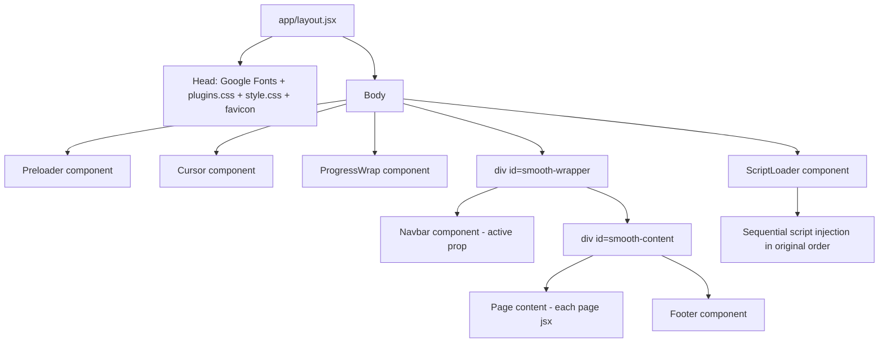

# TOURvex HTML → Next.js Conversion Plan

**Goal:** Convert the 15-page static HTML site to Next.js (App Router) with **pixel-identical UI/UX** — same preloader, smooth scrolling, hover effects, GSAP ScrollTrigger animations, sliders, counters, marquees, and popups.

**Confirmed decisions:**
- **Navigation:** Plain `<a>` tags (full page loads) — every navigation reloads the page exactly like the HTML site, guaranteeing identical preloader + JS re-initialization behavior. No Next.js `<Link>` client-side routing.
- **Rendering:** Client-side rendering — `'use client'` on all pages, effects initialize immediately after mount.

---

## Architecture



### Why this approach guarantees identical behavior

1. **Scripts load in the exact original order** after React mounts the DOM: jQuery → jquery-migrate → plugins.js → imagesLoaded → GSAP → ScrollSmoother → ScrollTrigger → smoother-script.js → springer → lenis → three.js → hover-effect → custom.js
2. **DOM structure preserved exactly** — `#smooth-wrapper` → navbar → `#smooth-content` wrapper is required by ScrollSmoother; all `.duru-*` animation classes, `data-background` attributes, and Swiper class hooks remain untouched in the JSX.
3. **Full page loads** mean `custom.js` runs fresh on every route — identical to the HTML site (no SPA state leaks, no ScrollTrigger cleanup bugs).
4. **Assets copied verbatim** — zero changes to CSS/JS files, so no risk of breaking minified plugin code.

---

## File Structure

```
wayouts-new/
├── package.json
├── next.config.mjs
├── jsconfig.json
├── public/
│   └── assets/            # copied verbatim from current assets/
│       ├── css/           # plugins.css, style.css, plugins/*
│       ├── js/            # all 13 JS files unchanged
│       ├── img/           # all images
│       └── fonts/         # all font files
├── src/
│   └── app/
│       ├── layout.jsx     # fonts, CSS links, body scaffold
│       ├── page.jsx       # index.html
│       ├── not-found.jsx  # 404.html
│       ├── about/page.jsx
│       ├── tours/page.jsx
│       ├── destination/page.jsx
│       ├── services/page.jsx
│       ├── service-details/page.jsx
│       ├── tour-details/page.jsx
│       ├── blog/page.jsx
│       ├── post/page.jsx
│       ├── contact/page.jsx
│       ├── team/page.jsx
│       ├── team-details/page.jsx
│       ├── testimonials/page.jsx
│       ├── faq/page.jsx
│       └── components/
│           ├── ScriptLoader.jsx
│           ├── Preloader.jsx
│           ├── Cursor.jsx
│           ├── ProgressWrap.jsx
│           ├── Navbar.jsx
│           └── Footer.jsx
```

---

## Implementation Steps

### Step 1 — Scaffold Next.js project
- `npx create-next-app@latest . --js --no-TS --app --src-dir --no-tailwind --import-alias "@/*"` (run inside `f:/2026/wayouts-new`, keeping existing HTML files in place during conversion)
- Remove default boilerplate CSS/imports from `globals.css` and `layout.jsx`.

### Step 2 — Copy assets verbatim
- Copy `assets/` → `public/assets/` (css, js, img, fonts — all unchanged).
- **Do not modify any CSS or JS file.**

### Step 3 — Root layout (`src/app/layout.jsx`)
- Metadata: title `TOURvex — Travel Agency Template`, favicon `/assets/img/favicon.ico`.
- `<head>`: Google Fonts preconnect + Barlow Condensed / Barlow Semi Condensed stylesheet link, `/assets/css/plugins.css`, `/assets/css/style.css`.
- Body renders: `<Preloader />`, `<Cursor />`, `<ProgressWrap />`, `<div id="smooth-wrapper">` containing `<Navbar />` and `<div id="smooth-content">{children}<Footer /></div>`, then `<ScriptLoader />`.

### Step 4 — ScriptLoader component (critical)
Client component that injects scripts **sequentially** (each waits for the previous `onload`) in this exact order:
1. `/assets/js/jquery-3.6.0.min.js`
2. `/assets/js/jquery-migrate-3.4.0.min.js`
3. `/assets/js/plugins.js`
4. `/assets/js/imagesloaded.pkgd.min.js`
5. `/assets/js/gsap.min.js`
6. `/assets/js/ScrollSmoother.min.js`
7. `/assets/js/ScrollTrigger.min.js`
8. `/assets/js/smoother-script.js`
9. `/assets/js/springer.min.js`
10. `/assets/js/lenis.min.js`
11. `/assets/js/three.min.js`
12. `/assets/js/hover-effect.umd.js`
13. `/assets/js/custom.js`

Implementation: `useEffect` with a recursive/promise-chained `document.createElement('script')` loader. Must run **after** the page DOM is mounted (React `useEffect` guarantees this). Since navigation is full page load, this runs once per page view — matching the HTML site exactly.

### Step 5 — Shared components
- **Preloader.jsx** — `.loader-wrap` with SVG path `id="svg"` and Loading text spans.
- **Cursor.jsx** — `.cursor` div.
- **ProgressWrap.jsx** — `.progress-wrap` with progress circle SVG.
- **Navbar.jsx** — full navbar with dropdowns; accepts `active` prop (`'home' | 'about' | 'tours' | ...`) to set `.nav-link active` per page; all links are plain `<a href="/...">`.
- **Footer.jsx** — identical footer markup ending with `.bg-text-style5` div.

### Step 6–16 — Convert each page
For every HTML file, mechanical HTML→JSX conversion:
- `class` → `className`
- Self-close void tags: ``, `<br>`, `<input>`, `<path>`, `<link>`
- `style="x: y"` → `style={{ x: 'y' }}` (rare — most styling is class-based)
- Keep ALL `data-*` attributes (`data-background`, `data-swiper-parallax`, `data-filter`, `data-gallery`, `data-scroll-nav`) — custom.js reads them
- Keep ALL `.duru-*` animation classes exactly
- Add `'use client'` at top
- Wrap content in `<main className="o-hidden">` inside `#smooth-content` (via layout)
- Set Navbar `active` prop per page

**Link rewrites (plain `<a>` tags only):**
| Original | Next.js |
|---|---|
| `index-2.html` / `index.html` | `/` |
| `about.html` | `/about` |
| `tours.html` | `/tours` |
| `destination.html` | `/destination` |
| `services.html` | `/services` |
| `service-details.html` | `/service-details` |
| `tour-details.html` | `/tour-details` |
| `blog.html` | `/blog` |
| `post.html` | `/post` |
| `contact.html` | `/contact` |
| `team.html` | `/team` |
| `team-details.html` | `/team-details` |
| `testimonials.html` | `/testimonials` |
| `faq.html` | `/faq` |
| `404.html` | `/not-found` (rendered automatically) |

Note: `index2.html` (Home Layout 2) does not exist in the project — dropdown link will point to `/` or be kept as-is per original behavior.

### Step 17 — 404 page
- `src/app/not-found.jsx` converted from `404.html` — Next.js automatically serves it for unknown routes.

### Step 18 — Verification checklist (per page)
- [ ] Preloader SVG curve animation plays and hides
- [ ] Custom cursor follows mouse, grows on links
- [ ] Smooth scroll (ScrollSmoother) works via wheel
- [ ] Navbar: rolling-text hover, dropdown menus, `.nav-scroll` background after 100px
- [ ] All `.duru-*` ScrollTrigger animations fire on scroll
- [ ] Swiper sliders (hero parallax, testimonials, team, gallery scroll) work
- [ ] Counters count up on scroll into view
- [ ] Marquees scroll infinitely
- [ ] Isotope gallery filters (tours page)
- [ ] Magnific popups / YouTube popups open
- [ ] Accordion FAQ slides
- [ ] Progress-wrap scroll-to-top circle fills
- [ ] Elastic cards + stack cards animate
- [ ] Mobile menu toggles correctly

### Step 19 — Production build
- `npm run build` — fix any JSX conversion errors
- `npm start` and re-verify key pages

---

## Risk Mitigations
| Risk | Mitigation |
|---|---|
| Scripts run before DOM ready | ScriptLoader starts in `useEffect` (post-mount); custom.js also wraps in `$(document).ready` |
| jQuery `$` conflicts | No other library uses `$`; loaded via script tags in order |
| ScrollSmoother needs `#smooth-wrapper`/`#smooth-content` | Structure preserved exactly in layout |
| Images 404 | Assets copied verbatim to `public/assets`; paths unchanged (`/assets/img/...`) |
| React hydration mismatches from JS DOM manipulation | All pages are client components; jQuery mutations happen after mount, React never re-renders them |
| `data-background` with `assets/img/bg.html` (odd file) | Keep as-is — matches original behavior |
